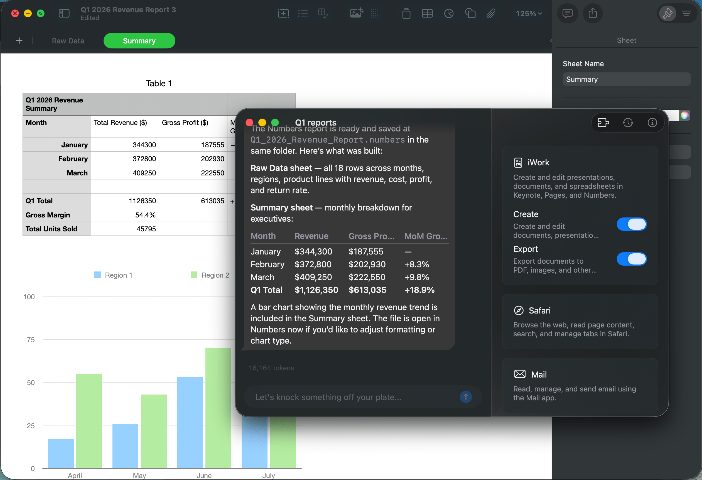

```
     _    _       _ _
    / \  | |_ ___| (_) ___ _ __
   / _ \ | __/ _ \ | |/ _ \ '__|
  / ___ \| ||  __/ | |  __/ |
 /_/   \_\\__\___|_|_|\___|_|
```

A native macOS client for Claude. No Electron. No Chromium. Just a fast, focused conversation window that feels like it belongs on your Mac.

<p align="center">
  
</p>

## Why

Atelier exists because AI conversations deserve the same speed and care as the rest of macOS. Electron wrappers burn battery, eat RAM, and can't integrate with the system. Atelier is built with SwiftUI and talks directly to macOS — Shortcuts, Spotlight, scheduled tasks via launchd, native drag-and-drop, and direct access to apps like Numbers, Mail, and Safari through capabilities.

## What it does

- **Conversation** — A single adaptive window per project. Text field, timeline, nothing else until you need it.
- **Capabilities** — Toggle access to macOS apps (iWork, Safari, Mail, and more). Claude can create spreadsheets, read web pages, and send emails — no browser extensions or MCP servers required.
- **Scheduled tasks** — Set up recurring prompts (daily briefings, weekly reports) that run in the background via launchd, even when the app is closed.
- **File awareness** — Drop files into the conversation. Claude reads them in context, scoped to your project directory.
- **Approvals and plans** — Review what Claude wants to do before it does it. Approve tools one at a time or for the session.
- **Session history** — Switch between conversations from the toolbar. Pick up where you left off.

## Requirements

- macOS 26 (Tahoe)
- Apple Silicon
- [Claude CLI](https://claude.ai/download)

## Building

Open `Atelier.xcodeproj` in Xcode 26 and run. The project uses local Swift packages — no dependency fetching required beyond Sparkle for auto-updates.

## Contributing

The `opportunities/` folder contains detailed write-ups for planned features and improvements, organized by domain (architecture, security, experience, context, hub, macOS). Pick one that interests you and open a PR.

## License

MIT
